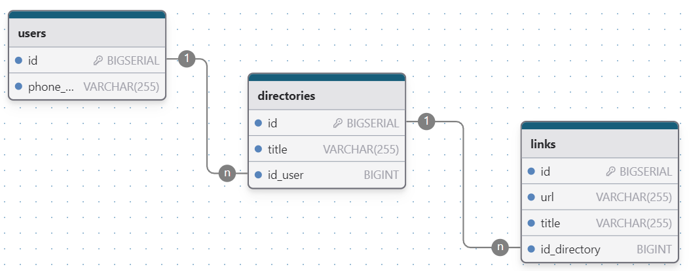

# Repository Bot

This application is a whatsapp bot that can be used to store links. This application was created to assist in storing and displaying links based on the directory that has been created. This simple application is expected to increase productivity in any case.

# Tech Stack

This application was created using `Node.js (v20.9.0)` and `Postgres (15.1)` with the list of libraries used as follows:

- `whatsapp-web.js v1.25.0`
- `pg v8.12.0`

# Entity Relationship Diagram

The following is the ERD used in designing the database:

# Commands

1. `!repo commands` -> get all commands information
2. `!repo register` -> Registering user
3. `!repo dir add [title]` -> Create directory
4. `!repo dir show` -> Show all directories
5. `!repo dir delete [title]` -> Delete directory by title
6. `!repo dir update [title] [new title]` -> Update directory title
7. `!repo dir show [title]` -> Show links attached on directory
8. `!repo link add [directory name] [url] [title]` -> Attach link on selected directory
9. `!repo link delete [id link]` -> Delete link
10. `!repo link update [id link] [- | new url] [- | new title]` -> Update link url or title, Use `‘-’` to mark no change.

# How to Run

1. Make sure the postgres database is running first. You can use docker (`see docker-compose.yaml`) to get postgre up and running and automatically create tables based on the ERD.
2. Create an `.env` file containing environment variables as in the `.env.example` file. Ensure that the POSTGRES_DB matches database name used on `./sql/ddl.sql`.
3. Run `npm run install` command
4. Run `node --env-file=.env .\index.js` command
5. Link the whatsapp account that will be used as a bot by scanning the QR Code that appears on the terminal.
6. The commands mentioned above can be used by sending a message to the whatsapp account that is the bot.
